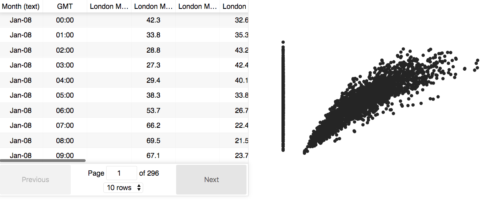

# Data for Good (2018) - #4: Cour des Comptes

Open dataset visualization and previsualization. The goal of this project is to build visualization tools from tabular data (.csv, .xls...) in order to facilitate access, filtering and previsualization of open datasets.

## Goals

- Previsualization: get the first few lines of the dataset to see its shape (column names, type of values etc.) before downloading it
- Filtering: select only a subset of the dataset to download
- Visualization: draw few charts from the data (eventually after filtering)

## Getting started

The app can be started with `yarn start` in the root directory.

This example takes a `.json` file from the [London air quality dataset](https://data.london.gov.uk/dataset/london-average-air-quality-levels) and shows an interactive table. A scatter plot of two variables is also displayed on the right. You should get the following result:

In this example, the table is created with [react-table](https://react-table.js.org/). The plot is made with [Victory](https://github.com/FormidableLabs/victory) from FormidableLabs.

## First attempt

- Get the data with url request
- Use [recline.js](http://okfnlabs.org/recline/) to do the previsualization and the visualization

It seems that people working on recline.js moved to other projects. Also, the use of remote url to fetch csv data is not working well (503 errors).

## New directions

### Server side

The current idea is to have an intermediate server written in Flask that will give the right `.csv` to the client. This could be done with [datasette](https://github.com/simonw/datasette) that can convert `.csv` files to API's.

If it can't be done, the server will:

- Get the right csv file according to request parameters
- Preprocess the file
- Convert it to json
- Sending back the json to the client

### Client side

On the client side, a pop-up window will be opened for previsualization containing small React components (for instance) with:

- Table display for data previsualization
- Some custom charts

